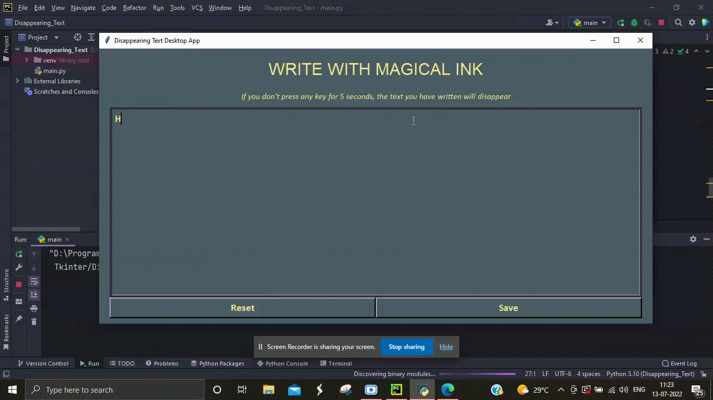

# Python Desktop Application - Disappearing Text Application

With the power of Python and the "tkinter" library, I have developed a sleek desktop application that serves as a text editor with unique features. Users can effortlessly type their thoughts and ideas, and if there is no typing activity for 5 seconds, the text will automatically disappear, allowing for a clean workspace. Additionally, users have the option to save their written text as a text document for future reference or editing. This user-friendly and efficient text editor simplifies the writing process, ensuring a clutter-free environment and convenient document management.

  

<h1> Program Flowchart </h1>

  

<h1> Guide to Build this Project </h1>

<h2> Step 1: UI Setup </h2>

  First decide on the widgets to show to user in program window. First comes the heading, then instructions, a typing area and then tow buttons, one to reset app and one to save our text into a text document.

<h2> Step 2: Tracking User's Typed Text </h2>

  Bind the typing area to <em> <b> KepPress </b> </em> so that whenever, user starts typing, we can track it. The moment first character is entered, we start a timer.
  We will reset app after 5 seconds. When another key is pressed, before 5 seconds elapse, we cancel the timer, if it exists. However, if 5 seconds have elapsed, everything that user has typed, will be deleted.

<h2> Step 3: Reset App Button </h2>

  We link our reset app button with the same function that we call using timer to reset app, so that the user can do it himself, if he wants to.

<h2> Step 4: Save Button </h2>

  When user clicks on save button, first we check if he has written something, if not nothing happens. If he has written something, we see if a text file already exists, where his wrtieups are stored, if not we create one. We append the user text to this file.

